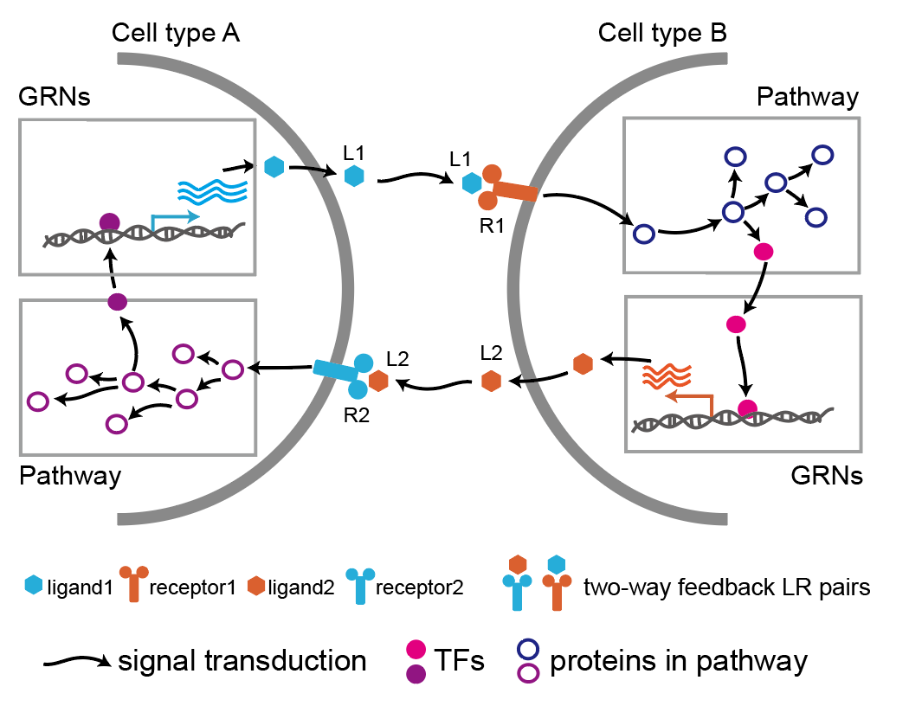

# LRLoop
 [](https://www.tidyverse.org/lifecycle/#maturing)

LRLoop is a full-featured R package for analyzing LR-Loops from bulk & single-cell RNA-seq data.

### LRLoop is currently in beta and will be in active development through the peer review process.

<hr>

<div  align="center">

</div>

<hr>

# Quick Installation of LRLoop

**First, install devtools (for installing GitHub packages) if it isn't already installed:**
```{r}
if (!requireNamespace("devtools", quietly = TRUE)) install.packages("devtools")
```

**Then, install nichenetr if it isn't already installed:**
```{r}
devtools::install_github("saeyslab/nichenetr")
```

**Then, install all of the LRLoop dependencies:**
```{r}
install.packages(c('tidyverse','Seurat','ggplot2','dplyr','circlize','igraph','RColorBrewer','writexl','pheatmap'))
```

**Lastly, install LRLoop:**
```{r}
devtools::install_github('https://github.com/Pinlyu3/LRLoop',force = TRUE)
```

<hr>

# Learning to use LRLoop
To learn how to use LRLoop, read the following vignettes explaining several types of analyses:


-- [Perform LRLoop analysis starting form a Seurat object](vignettes/ligand_activity_geneset.md)


<hr>

# Issues using LRLoop?

LRLoop is currently in __beta__. If you think you have found a bug, please [report an issue on Github](https://github.com/Pinlyu3/LRLoop/issues) with the __Bug Report__ form.


