# Perform LRLoop analysis starting from Seurat objects


## STEP 1: Get ligand_target_matrix and the receptor_target_matrix

Reference: https://github.com/saeyslab/nichenetr/blob/master/vignettes/model_construction.md

- [Perform LRLoop analysis using custom GRNs](https://github.com/Pinlyu3/LRLoop/blob/main/vignettes/Custom_GRNs.md)

Remark: The calculation of the receptor_target_matrix uses some functions slightly modified from the ones in package nichenetr. Users could choose to skip this step and use a set of our pre-calculated default networks in the folder “Networks/DefaultNetworks”.


## STEP 2: Prepare expression data

Normalized Seurat object of the cell types of interest (celltype1 and celltype2) "ct1obj" and "ct2obj":

1. their gene expression data "ct1obj@assays$RNA@data" and "ct2obj@assays$RNA@data" should have the same rows (genes in rows); 
2. their metadata "ct1obj<span>@<span>meta.data" and "ct2obj<span>@<span>meta.data" should both have the column "Condition" with the same set of conditions of interest.


## STEP 3: LRLoop analysis

### 3.1 load packages
``` r
# This script requires the following packages
library(nichenetr)
library(tidyverse)
library(RColorBrewer)
library(writexl)
library(Seurat)
library(pheatmap)
library(ggplot2)
library(miceadds)
library(circlize)
library(igraph)
```

### 3.1 load data

**Required inputs**

3.2.1.  Seurat object (data LogNormalized) of celltype1 (ct1) and celltype2 (ct2) "ct1obj" and "ct2obj":
    a) Their corresponding expression data "ct1obj@assays$RNA@data" and "ct2obj@assays$RNA@data" should have the same rows (genes in rows);
    b) Their metadata "ct1obj<span>@<span>meta.data" and "ct2obj<span>@<span>meta.data" both have the column "Condition" with the same set of condtions of interest.

3.2.2. lr_network with columns "from" (ligands in this column) and "to" (receptors in this column).

3.2.3. ligand_target_matrix_ct1_to_ct2 & ligand_target_matrix_ct2_to_ct1: resulted from Construct_ligandreceptor_target_matrix.R. Users can also choose to use a default pre-calculated ligand_target_matrix.

3.2.4. receptor_target_matrix_ct1_to_ct2 & receptor_target_matrix_ct2_to_ct1: resulted from Construct_ligandreceptor_target_matrix.R. Users can also choose to use a default pre-calculated receptor_target_matrix.

3.2.4.1. Matrices resulted from STEP 1 ([Perform LRLoop analysis using custom GRNs](https://github.com/Pinlyu3/LRLoop/blob/main/vignettes/Custom_GRNs.md))

Remark: For the ligand_target and receptor_target matrices, users can also choose to skip STEP 1 and use a set of our pre-calculated matrices in the "Networks/DefaultNetworks/" folder in [google drive](https://drive.google.com/drive/folders/1WV0iSlAXCUwSZMSBnzsHdZc26RuyfunC?usp=sharing)


**Load the Seurat objects "ct1obj" and "ct2obj" for celltype1 and celltype2 of interest**

``` r
### Load the Seurat objects "ct1obj" and "ct2obj" for celltype1 and celltype2 of interest
load("ExampleData/ct1obj.RData")
load("ExampleData/ct2obj.RData")

#> ct1obj
#An object of class Seurat 
#27933 features across 631 samples within 1 assay 
#Active assay: RNA (27933 features, 0 variable features)
#> ct2obj
#An object of class Seurat 
#27933 features across 5942 samples within 1 assay 
#Active assay: RNA (27933 features, 0 variable features)
#> unique(ct1obj@meta.data[,'Condition'])
#[1] "mmP60"      "mmNMDA03"   "mmNMDA06"   "mmNMDA12"   "mmNMDA24"   "mmNMDA36"   "mmNMDA48"   "mmNMDA48FI" "mmNMDA72"  
#> unique(ct2obj@meta.data[,'Condition'])
#[1] "mmP60"      "mmNMDA03"   "mmNMDA06"   "mmNMDA12"   "mmNMDA24"   "mmNMDA36"   "mmNMDA48"   "mmNMDA48FI" "mmNMDA72" 
``` 

**Load ligand-receptor network and ligand/receptor-target potential matrices**

``` r
# Remark: In this example, these ligand/receptor_target_matrix_* were calculated based on the lr_network, sig_network and gr_networks filtered by the genes detected in microglia or MG, respectively
load("ExampleData/lr_network.RData")

#> head(lr_network)
## A tibble: 6 x 4
#  from   to    source         database
#  <chr>  <chr> <chr>          <chr>   
#1 Cxcl1  Cxcr2 kegg_cytokines kegg    
#2 Cxcl2  Cxcr2 kegg_cytokines kegg    
#3 Cxcl5  Cxcr2 kegg_cytokines kegg    
#4 Ppbp   Cxcr2 kegg_cytokines kegg    
#5 Cxcl9  Cxcr3 kegg_cytokines kegg    
#6 Cxcl10 Cxcr3 kegg_cytokines kegg    

lr_network = unique(as.matrix(lr_network)[,c('from','to')]) 
lr_network = lr_network[lr_network[,'from'] %in% rownames(ct1obj@assays$RNA@data) & lr_network[,'to'] %in% rownames(ct1obj@assays$RNA@data),]

#> head(lr_network)
#     from     to     
#[1,] "Cxcl1"  "Cxcr2"
#[2,] "Cxcl2"  "Cxcr2"
#[3,] "Cxcl5"  "Cxcr2"
#[4,] "Ppbp"   "Cxcr2"
#[5,] "Cxcl9"  "Cxcr3"
#[6,] "Cxcl10" "Cxcr3"
```


``` r
load("ExampleData/ligand_target_matrix_ct1_to_ct2.RData")
load("ExampleData/ligand_target_matrix_ct2_to_ct1.RData")
load("ExampleData/receptor_target_matrix_ct1_to_ct2.RData")
load("ExampleData/receptor_target_matrix_ct2_to_ct1.RData")

#> ligand_target_matrix_ct1_to_ct2[1:5,1:5]
#        Cxcl1        Cxcl2        Cxcl5         Ppbp       Cxcl12
#A1bg    0.0008333858 0.0008145524 0.0008655993 0.0006291958 0.0011008142
#A1cf    0.0008510756 0.0005766328 0.0005491118 0.0004963418 0.0007971723
#A2m     0.0014920135 0.0010681160 0.0010995387 0.0011364595 0.0020007205
#A3galt2 0.0005118905 0.0002699805 0.0002650488 0.0002536862 0.0003670101
#A4galt  0.0012909658 0.0008870256 0.0009401015 0.0008000234 0.0014363265

# Or just use a set of our pre-calculated default networks:
#load("Networks/DefaultNetworks/mm/NicheNet_and_NATMI_bonafide_filtered/lr_network.RData")
#load("Networks/DefaultNetworks/mm/NicheNet_and_NATMI_bonafide_filtered/ligand_target_matrix.RData")
#load("Networks/DefaultNetworks/mm/NicheNet_and_NATMI_bonafide_filtered/receptor_target_matrix.RData")
# Then run:
#lr_network = unique(as.matrix(lr_network)[,c('from','to')]) 
#lr_network = lr_network[lr_network[,'from'] %in% rownames(ct1obj@assays$RNA@data) & lr_network[,'to'] %in% rownames(ct1obj@assays$RNA@data),]
#ligand_target_matrix_ct1_to_ct2 = ligand_target_matrix
#ligand_target_matrix_ct2_to_ct1 = ligand_target_matrix
#receptor_target_matrix_ct1_to_ct2 = receptor_target_matrix
#receptor_target_matrix_ct2_to_ct1 = receptor_target_matrix
``` 


### 3.3 LRloop analysis: Basics

**Identify the conditions of interest**

``` r
conditions = unique(ct1obj@meta.data[,'Condition'])

#> conditions
#[1] "mmP60"      "mmNMDA03"   "mmNMDA06"   "mmNMDA12"   "mmNMDA24"   "mmNMDA36"   "mmNMDA48"   "mmNMDA48FI" "mmNMDA72"   
```


**Differential expression analysis for all condition pairs of interest (if length(conditions) >= 2)**

``` r
# Remark: Users can use other methods to find differentially expressed genes of interest, just note that the results of this step should be two lists "DEGinfo_ct1" and "DEGinfo_ct2" in which:
# "DEGinfo_ct1$DEG" and "DEGinfo_ct2$DEG" are lists where each element of them stores the DEA results for one pair of conditions of interest, which is a matrix with genes in rows and at least two colomns "ave_log2FC" and "p_val_adj";  
# "DEGinfo_ct1$DEgenes" and "DEGinfo_ct2$DEgenes" are vectors of differentially expressed gene symbols (the union of the DEGs resulted from all pairs of conditions of interest)
# In this example, for each cell type (microglia and MG), we perform DEA between each NMDA time point and mmP60 (control) and collect the union of all the DEGs

DEGinfo_ct1 = get_DEG(seuratobj = ct1obj, idents_1 = conditions[2:9], idents_2 = conditions[1], 
                      only_pos = FALSE, min_pct = 0.1, logfc_threshold = 0.25, p_val_adj_threshold = 0.05, test_use = "wilcox")
DEGinfo_ct2 = get_DEG(seuratobj = ct2obj, idents_1 = conditions[2:9], idents_2 = conditions[1], 
                      only_pos = FALSE, min_pct = 0.1, logfc_threshold = 0.25, p_val_adj_threshold = 0.05, test_use = "wilcox")

#> names(DEGinfo_ct1)
#[1] "DEG"     "DEgenes"
#> names(DEGinfo_ct1$DEG)
#[1] "mmNMDA03_vs_mmP60"   "mmNMDA06_vs_mmP60"   "mmNMDA12_vs_mmP60"   "mmNMDA24_vs_mmP60"   "mmNMDA36_vs_mmP60"   "mmNMDA48_vs_mmP60"   "mmNMDA48FI_vs_mmP60" "mmNMDA72_vs_mmP60"  
#> head(DEGinfo_ct1$DEG$mmNMDA03_vs_mmP60)
#             p_val avg_log2FC pct.1 pct.2    p_val_adj
#Fth1  4.077072e-21   3.664240 1.000 0.793 1.138849e-16
#Srgn  3.063184e-20   3.410460 0.969 0.103 8.556391e-16
#Ftl1  2.086013e-18   2.617280 1.000 0.931 5.826861e-14
#Hmox1 3.108638e-18   5.565917 0.862 0.052 8.683357e-14
#Ccl3  2.758505e-17   4.892835 0.908 0.224 7.705331e-13
#Id2   2.901389e-17   4.377565 0.815 0.034 8.104450e-13
#> head(DEGinfo_ct1$DEgenes)
#[1] "Fth1"  "Srgn"  "Ftl1"  "Hmox1" "Ccl3"  "Id2"  

# If there is only one condition or DEA info is not desired, just create the lists DEGinfo_ct1 and DEGinfo_ct2 in the required formats as spot holders for other relevant functions that use them as variables. For example, one can create them by running:
#DEGinfo_ct1 = get_DEG(seuratobj = ct1obj, idents_1 = conditions[1], idents_2 = conditions[1], 
#                      only_pos = FALSE, min_pct = 0, logfc_threshold = 0, p_val_adj_threshold = 1.1)
#DEGinfo_ct2 = get_DEG(seuratobj = ct2obj, idents_1 = conditions[1], idents_2 = conditions[1], 
#                      only_pos = FALSE, min_pct = 0, logfc_threshold = 0, p_val_adj_threshold = 1.1)
#DEGinfo_ct1$DEgenes = DEGinfo_ct1$DEgenes[sample(length(DEGinfo_ct1$DEgenes), 0.2*length(DEGinfo_ct1$DEgenes))]
#DEGinfo_ct2$DEgenes = DEGinfo_ct2$DEgenes[sample(length(DEGinfo_ct2$DEgenes), 0.2*length(DEGinfo_ct2$DEgenes))]

```


**Prepare a list of some basic data info**

``` r
Basics = PrepareBasics(ct1obj, ct2obj, min_pct = 0.1, geneset_ct1 = DEGinfo_ct1$DEgenes, geneset_ct2 = DEGinfo_ct2$DEgenes,
                       lr_network, 
                       ligand_target_matrix_ct1_to_ct2, receptor_target_matrix_ct1_to_ct2, ligand_target_matrix_ct2_to_ct1, receptor_target_matrix_ct2_to_ct1,
                       discrete_error_rate = 0.1, discrete_cutoff_method = "distribution", discrete_fdr_method = "global", allow_feedback_delay = FALSE)
# Here in PrepareBasics:
# min_pct: Cutoff value on the detection rate of genes in each cell type, each condition, for the identification of "expressed" genes. A number between 0 and 1.
#          For example, min_pct = 0.1 means that for each cell type and condition, the genes that are detected in at least 10 percent of the cells are considered "expressed".
# geneset_ct1, geneset_ct2: Vectors of gene symbols considered as the target gene set of interest (for example, the differentailly expressed genes) in cell type1/cell type2 for the calculation of the nichenetr based ligand/receptor activity scores.  
# discrete_error_rate: Value of the error_rate variable of the nichenetr package function "make_discrete_ligand_target_matrix" -- FDR for cutoff_method "fdrtool" and "distribution"; number between 0 and 1 indicating which top fraction of target genes should be returned for cutoff_method "quantile".
# discrete_cutoff_method: Value of the cutoff_method variable of the nichenetr package function "make_discrete_ligand_target_matrix" -- Method to determine which genes can be considered as a target and which genes not, based on the regulatory probability scores. Possible options: "distribution", "fdrtool" and "quantile".
# discrete_fdr_method: Value of the fdr_method variable of the nichenetr package function "make_discrete_ligand_target_matrix" -- Only relevant when cutoff_method is "fdrtool". Possible options: "global" and "local"
# allow_feedback_delay: Default value is FALSE, in this case, when identifying LRloops, the candidate ligand-receptor pairs L1-R1 and L2-R2 are limited to the ones that are simultaneously expressed in some condition;  If TRUE, L1-R1 and L2-R2 expressed in different conditions are allowed to form an LRloop.  

#> names(Basics)
#[1] "ave_expr_ct1"                          "ave_expr_ct2"                          "pct_expr_ct1"                          "pct_expr_ct2"                         
#[5] "thresh_expr_ct1"                       "thresh_expr_ct2"                       "genes_thresh_expr_ct1"                 "genes_thresh_expr_ct2"                
#[9] "lr_expr_ct1_to_ct2"                    "lr_expr_ct2_to_ct1"                    "ligand_activities_matrix_ct1_to_ct2"   "receptor_activities_matrix_ct1_to_ct2"
#[13] "ligand_activities_matrix_ct2_to_ct1"   "receptor_activities_matrix_ct2_to_ct1" "myLRL"                                 "allLRL"
``` 


**Get the LRloop network matrix**

``` r
LRloop_network = Basics$myLRL$`R1->L2_R2->L1`

#> head(LRloop_network)
#     L2      R2       L1      R1      
#[1,] "Tgfb2" "Tgfbr1" "Tgfb1" "Itgav" 
#[2,] "Tgfb2" "Tgfbr2" "Psap"  "Gpr37" 
#[3,] "Tgfb2" "Tgfbr2" "Calr"  "Itgav" 
#[4,] "Tgfb2" "Tgfbr2" "Mfng"  "Notch2"
#[5,] "Cadm1" "Cadm1"  "Cadm1" "Cadm1" 
#[6,] "Igf2"  "Igf1r"  "Apoe"  "Sorl1"  
```


**(Optional) Calculate LRscores of the expressed L1R1 and L2R2 pairs (will be used as edge weights of Circos plots)**

``` r
# Remark: Users can easily add or modify the score calculation methods in the function "LRscores"
overallaveexprm = log1p(mean(cbind(expm1(as.matrix(ct1obj@assays$RNA@data)), expm1(as.matrix(ct2obj@assays$RNA@data))))) # a scalar value used in the LRscore calculation when the method is set to 'scsigr' or individual_scale'

#> overallaveexprm
#[1] 0.3060127

# Remark: If ct1obj and ct2obj are sub-objects taken from a big Seurat object, and one needs to investigate ligand-receptor interactions between multiple cell type pairs, to make the LRscores comparable across different cell type pairs, we should use the same scalar value for all calculations.
# For example, suppose the big Seurat object is seuratobj (data LogNormalized), one can calculate and save the following beforehand:
# overallaveexprm = log1p(mean(expm1(as.matrix(seuratobj@assays$RNA@data))))

LRscore_ct1_to_ct2 = get_LRscores(lr_expr = Basics$lr_expr_ct1_to_ct2$bind, conditions = conditions, 
                                  value.use_from = Basics$ave_expr_ct1, value.use_to = Basics$ave_expr_ct2, 
                                  scalar = overallaveexprm, LRscore_method = 'scsigr',
                                  thresh_expr_from = Basics$thresh_expr_ct1, thresh_expr_to = Basics$thresh_expr_ct2, thresh_expr_cut = FALSE,
                                  LRL_eachcondition = Basics$myLRL$eachcondition,
                                  LRL_filter = 'none')
LRscore_ct2_to_ct1 = get_LRscores(lr_expr = Basics$lr_expr_ct2_to_ct1$bind, conditions = conditions, 
                                  value.use_from = Basics$ave_expr_ct2, value.use_to = Basics$ave_expr_ct1, 
                                  scalar = overallaveexprm, LRscore_method = 'scsigr',
                                  thresh_expr_from = Basics$thresh_expr_ct2, thresh_expr_to = Basics$thresh_expr_ct1, thresh_expr_cut = FALSE,
                                  LRL_eachcondition = Basics$myLRL$eachcondition,
                                  LRL_filter = 'none') 

#> head(Basics$lr_expr_ct1_to_ct2$bind)
#     from    to     
#[1,] "Cntn1" "Nrcam"
#[2,] "Cadm1" "Cadm1"
#[3,] "Negr1" "Negr1"
#[4,] "Vtn"   "Itgav"
#[5,] "Vtn"   "Itgb5"
#[6,] "Igf1"  "Igf1r"
#> head(Basics$ave_expr_ct1)
#            mmP60  mmNMDA03 mmNMDA06  mmNMDA12  mmNMDA24  mmNMDA36  mmNMDA48 mmNMDA48FI  mmNMDA72
#Xkr4    0.0000000 0.0000000  0.00000 0.0000000 0.0000000 0.0230486 0.0000000    0.00000 0.0000000
#Gm1992  0.0000000 0.0000000  0.00000 0.0000000 0.0000000 0.0000000 0.0000000    0.00000 0.0000000
#Gm37381 0.0000000 0.0000000  0.00000 0.0000000 0.0000000 0.0000000 0.0000000    0.00000 0.0000000
#Sox17   0.0000000 0.0000000  0.00000 0.0000000 0.0000000 0.0000000 0.0000000    0.00000 0.0000000
#Gm37323 0.0000000 0.0000000  0.00000 0.0000000 0.0000000 0.0000000 0.0000000    0.00000 0.0000000
#Mrpl15  0.6471934 0.4918144  0.21113 0.6079308 0.5227859 0.5845097 0.4401679    0.55896 0.3714317
#LRscore_method: The method of calculating the LRscores, available options are 'mean', 'individual_scale', 'individual_scale_exp', 'product', 'bias_receptor' and 'scsigr'
#head(Basics$thresh_expr_ct1)
#        mmP60 mmNMDA03 mmNMDA06 mmNMDA12 mmNMDA24 mmNMDA36 mmNMDA48 mmNMDA48FI mmNMDA72
#Xkr4        0        0        0        0        0        0        0          0        0
#Gm1992      0        0        0        0        0        0        0          0        0
#Gm37381     0        0        0        0        0        0        0          0        0
#Sox17       0        0        0        0        0        0        0          0        0
#Gm37323     0        0        0        0        0        0        0          0        0
#Mrpl15      1        1        1        1        1        1        1          1        1
#thresh_expr_cut: TRUE or FAlSE. If TRUE, the LRscore of ligand-receptor pairs for which either the ligand or the recepor is not expressed as defined in thresh_expr_from and thresh_expr_to, respectively, is set to 0.
#LRL_eachcondition: List of LRloop networks in each condition.
#LRL_filter: "L1R1", "L2R2" or "none".  "L1R1" ("L2R2"): The LR pairs are from ct1 (ct2) to ct2 (ct1) and apply the LRloop filter in each condition, that is, in each condition, an LRscore will be set to 0 if the LR pair does not form any LRloop in that conditon. "none": No LRloop filter applied. 
#> head(LRscore_ct1_to_ct2)
#     from    to      mmP60               mmNMDA03            mmNMDA06            mmNMDA12            mmNMDA24            mmNMDA36            mmNMDA48            mmNMDA48FI          mmNMDA72           
#[1,] "Cntn1" "Nrcam" "0.700875949564521" "0.421899538729416" "0"                 "0"                 "0"                 "0.439953572661513" "0.386924637006801" "0.381820284661351" "0.164722835765612"
#[2,] "Cadm1" "Cadm1" "0.837837903885129" "0.836832042750149" "0.826856069285421" "0.843870934371788" "0.801584027354358" "0.81842076770425"  "0.811217034401163" "0.774025099109966" "0.806843973425742"
#[3,] "Negr1" "Negr1" "0.74836885595467"  "0.274150993205106" "0.357526455903131" "0"                 "0.348342170937864" "0.383991067120397" "0.277286910370301" "0.236749018933602" "0.224390923657688"
#[4,] "Vtn"   "Itgav" "0.720337468653989" "0.761382700046915" "0.781760361274263" "0.749407138949124" "0.648311455923783" "0.755421130422588" "0.716382339902723" "0.620057544015233" "0.695830983638457"
#[5,] "Vtn"   "Itgb5" "0.679236095429675" "0.569209173911564" "0.564360896574841" "0.533313398662959" "0.514333498614948" "0.666463571454103" "0.624268666392938" "0.522903284832386" "0.567473065827716"
#[6,] "Igf1"  "Igf1r" "0.735677425105909" "0.457142015793351" "0"                 "0.328033574092079" "0.28576613285034"  "0.751907754733162" "0.723709627196896" "0.518187031914579" "0.802080634951742"
```


**Cluster the genes in ct1, ct2, and expressed L1-R1 and L2-R2 pairs (will be used to color the nodes and edges of Circos plots). These are also required inputs of the function "LRL_info_collection".**

``` r
# genes_cluster_ct1, genes_cluster_ct2: Vector of cluster-names (integers 0,1,2,...) with the name of each element the corresponding gene symbol.
# Remark: The clusters are denoted by consecutive integers from 0.  Users can cluster the genes differently as preferred.
# Here as an example, the differentially expressed genes in each cell type were pre-clustered by k-means clustering and the none-DEGs belong to cluster 0.
load("ExampleData/Clusters_kmeans/genes_cluster_ct1.RData")
load("ExampleData/Clusters_kmeans/genes_cluster_ct2.RData")

#> head(genes_cluster_ct1)
#Fth1  Srgn  Ftl1 Hmox1  Ccl3   Id2 
#   4     4     1     4     4     4 
#> head(genes_cluster_ct2)
#Ifrd1     Srxn1 Tnfrsf12a     Actg1      Maff        F3 
#    2         2         2         2         2         2 

```


<div align="center">
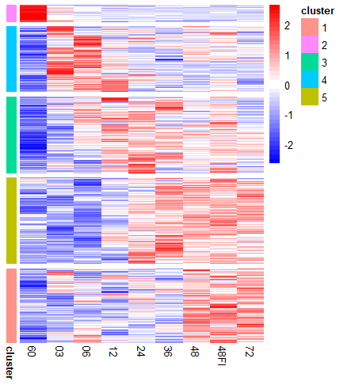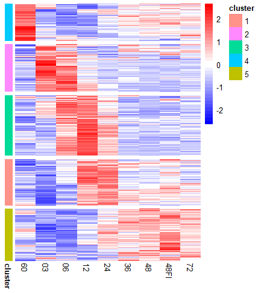
</div>


``` r
# L1R1_cluster, L2R2_cluster: Vector of cluster-names (integers 0,1,2,...) with the name of each element the corresponding ligand-receptor pair gene symbols.
# Remark: The clusters are denoted by consecutive integers from 0.  Users can cluster them differently as preferred.
# Here as an example, the "expressed" ligand-receptor pairs where either the ligand or the receptor is differentially expressed at some NMDA time point compared to control "mmP60" were pre-clustered according to the calculated LRscores by k-means clustering across all conditions, and the none-differentially expressed ones belong to cluster 0.

load("ExampleData/Clusters_kmeans/L1R1_cluster.RData")
load("ExampleData/Clusters_kmeans/L2R2_cluster.RData")

#> head(L1R1_cluster)
#Spp1_Cd44 Spp1_Itgav Spp1_Itgb1 Psap_Gpr37   Vim_Cd44 Gnai2_Cav1 
#        4          4          4          5          4          1 
#> head(L2R2_cluster)
#Mif_Cd74   Hbegf_Cd9  Timp1_Cd63   Apoe_Lrp1 Rps19_C5ar1    App_Cd74 
#       1           1           1           3           1           1 

# If such clusterings are not desired, just create genes_cluster_ct1, genes_cluster_ct2, L1R1_cluster and L2R2_cluster in the required formats as spot holders for other relevant functions that use them as variables. For example, one can create them by running:
#genes_cluster_ct1 = rep(0, nrow(ct1obj@assays$RNA@data))
#names(genes_cluster_ct1) = rownames(ct1obj@assays$RNA@data)
#genes_cluster_ct2 = rep(0, nrow(ct2obj@assays$RNA@data))
#names(genes_cluster_ct2) = rownames(ct2obj@assays$RNA@data)
#lr_expr_ct1_to_ct2_linked = sprintf("%s_%s", Basics$lr_expr_ct1_to_ct2$bind[,'from'], Basics$lr_expr_ct1_to_ct2$bind[,'to'])
#L1R1_cluster = rep(0, length(lr_expr_ct1_to_ct2_linked))
#names(L1R1_cluster) = lr_expr_ct1_to_ct2_linked
#lr_expr_ct2_to_ct1_linked = sprintf("%s_%s", Basics$lr_expr_ct2_to_ct1$bind[,'from'], Basics$lr_expr_ct2_to_ct1$bind[,'to'])
#L2R2_cluster = rep(0, length(lr_expr_ct2_to_ct1_linked))
#names(L2R2_cluster) = lr_expr_ct2_to_ct1_linked
```

<div align="center">
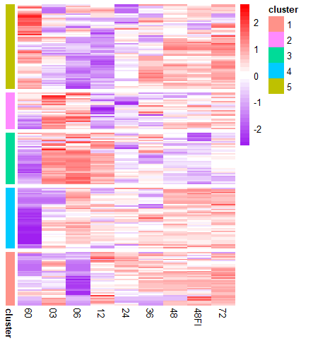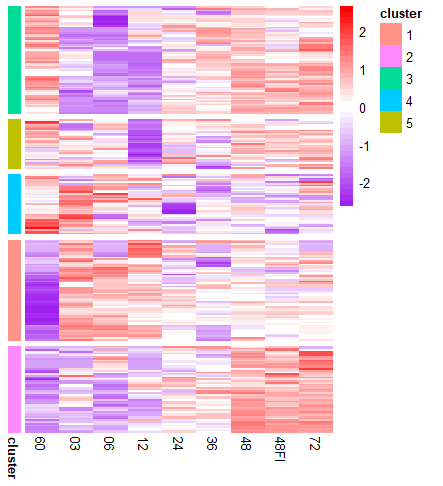
</div>


**Use LRLoop as a filter: only keep the LR pairs that form LRLoops** 

``` r
### LRloop info collection and write into .csv files.  
LRloop_info = LRL_info_collection(LRloop_network = LRloop_network,
                                  LRL_eachcondition = Basics$myLRL$eachcondition,
                                  valuse_ct1 = Basics$ave_expr_ct1, valuse_ct2 = Basics$ave_expr_ct2, scalar = overallaveexprm, 
                                  ScoreConditionIdx = c(1,2,3,4,5,6,7,9), # Check the colnames of valuse_ct1 before set this vector up.  In this example, suppose we don't want to consider the condition "mmNMDA48FI": colnames(Basics$ave_expr_ct1): [1] "mmP60" "mmNMDA03" "mmNMDA06" "mmNMDA12" "mmNMDA24" "mmNMDA36" "mmNMDA48" "mmNMDA48FI" "mmNMDA72"  
                                  LRscore_method = 'scsigr', LoopScore_method = "ave_geo",
                                  LRlfcscore_method = "mean", LooplfcScore_method = 'ave_ari',
                                  DEGinfo_ct1 = DEGinfo_ct1, DEGinfo_ct2 = DEGinfo_ct2,
                                  genes_cluster_ct1 = genes_cluster_ct1, genes_cluster_ct2 = genes_cluster_ct2, 
                                  L1R1_cluster = L1R1_cluster, L2R2_cluster = L2R2_cluster,
                                  ave_expr_ct1 = Basics$ave_expr_ct1, ave_expr_ct2 = Basics$ave_expr_ct2,
                                  pct_expr_ct1 = Basics$pct_expr_ct1, pct_expr_ct2 = Basics$pct_expr_ct2,
                                  ligand_activities_matrix_ct1_to_ct2 = Basics$ligand_activities_matrix_ct1_to_ct2, 
                                  receptor_activities_matrix_ct1_to_ct2 = Basics$receptor_activities_matrix_ct1_to_ct2,
                                  ligand_activities_matrix_ct2_to_ct1 = Basics$ligand_activities_matrix_ct2_to_ct1,
                                  receptor_activities_matrix_ct2_to_ct1 = Basics$receptor_activities_matrix_ct2_to_ct1)

#> names(LRloop_info)
#[1] "LRloop expression"               "L1R1 expression"                 "L2R2 expression"                 "LRloopDEG"                      
#[5] "L1R1DEG"                         "L2R2DEG"                         "L1R1L2R2 clusters"               "LRloop expr_score"              
#[9] "L1R1 expr_score"                 "L2R2 expr_score"                 "LRloop logFC_score"              "L1R1 logFC_score"               
#[13] "L2R2 logFC_score"                "LRloop nichenet_score"           "L1R1 nichenet_score"             "L2R2 nichenet_score"            
#[17] "L1R1 expr_score-LRLoop_filtered" "L2R2 expr_score-LRLoop_filtered"

filedir1 = "ExampleData/outputs_complete/" # Specify a folder directory to save the .csv files
writeLRL(LRloop_info, filedir1)
```

**(Optional) Filter the LRloops, then collect and write the corresponding LRloop info again**

``` r
# Filter by user preferred LRloop_info based conditions: please check the .csv files from the last step with filenames like "LRloop ***.csv" or "L1R1L2R2 ***.csv" for filtering options:
# The names of the list LRloop_info and the .csv files created from the last step are consistent.
# LRloop expression.csv: The LRloop network, together with the average expression values of each gene and the detection rates of each gene in the corresponding cell types and each condition
# LRloopDEG.csv: Differential expresssion information of the genes in LRloop_network 
# L1R1L2R2 clusters.csv: User defined clusters of L1, R1, L2, R2, L1-R1 pairs and L2-R2 pairs
# LRloop expr_score.csv: The L1R1L2R2 LoopScore calculated based on valuse_ct1 and valuse_ct2
# LRloop logFC_score.csv: The L1R1L2R2 LoopScore calculated based on the absolute values of the logFC of L1, R1, L2 and R2 (the ones ended with "max" and "mean" are the maximum and mean value of the scores calulated from all the conditions pairs under comparison; the ones ended with "maxlogFC_basedScore" and "maxlogFC_basedScore" are calculated directly from the maximum and mean values of the logFC absolute values across all comparisons)
# LRloop nichenet_score.csv: The nichenet algorithm based scores of L1, R1, L2 and L2 in each L1R1L2R2 loop
# The column names of these .csv files should be self-explanatory
# Here as an example, we filter the LRloop_network by requiring:
# a) L1 and L2 are differentially expressed in some NMDA time point compared to control mmP60
# b) The L1_activityscore and the R1_activityscore calculated by nichenetr's algorithm are no less than 0.05
idx = which(LRloop_info$LRloopDEG[,'L1_diff'] == 'TRUE' & LRloop_info$LRloopDEG[,'L2_diff'] == 'TRUE' &
              as.numeric(LRloop_info$`LRloop nichenet_score`[,'L1_nichenetscore']) >= 0.05 & 
              as.numeric(LRloop_info$`LRloop nichenet_score`[,'R1_nichenetscore']) >= 0.05)
LRloop_network_sub = LRloop_network[idx,]
LRloop_info_sub = LRL_info_collection(LRloop_network = LRloop_network_sub, # Note that compared to the first time running the function "LRL_info_collection", this is the only variable needs to be changed
                                      LRL_eachcondition = Basics$myLRL$eachcondition,
                                      valuse_ct1 = Basics$ave_expr_ct1, valuse_ct2 = Basics$ave_expr_ct2, scalar = overallaveexprm, 
                                      ScoreConditionIdx = c(1,2,3,4,5,6,7,9), 
                                      LRscore_method = 'scsigr', LoopScore_method = "ave_geo",
                                      LRlfcscore_method = "mean", LooplfcScore_method = 'ave_ari',
                                      DEGinfo_ct1 = DEGinfo_ct1, DEGinfo_ct2 = DEGinfo_ct2,
                                      genes_cluster_ct1 = genes_cluster_ct1, genes_cluster_ct2 = genes_cluster_ct2, 
                                      L1R1_cluster = L1R1_cluster, L2R2_cluster = L2R2_cluster,
                                      ave_expr_ct1 = Basics$ave_expr_ct1, ave_expr_ct2 = Basics$ave_expr_ct2,
                                      pct_expr_ct1 = Basics$pct_expr_ct1, pct_expr_ct2 = Basics$pct_expr_ct2,
                                      ligand_activities_matrix_ct1_to_ct2 = Basics$ligand_activities_matrix_ct1_to_ct2, 
                                      receptor_activities_matrix_ct1_to_ct2 = Basics$receptor_activities_matrix_ct1_to_ct2,
                                      ligand_activities_matrix_ct2_to_ct1 = Basics$ligand_activities_matrix_ct2_to_ct1,
                                      receptor_activities_matrix_ct2_to_ct1 = Basics$receptor_activities_matrix_ct2_to_ct1)
filedir2 = "ExampleData/outputs_filtered/"
writeLRL(LRloop_info_sub, filedir2)

### Let's have a look at some most basic info about the identified ligand-receptor pairs
MostBasicLRinfo(LRloop_info = LRloop_info_sub)
#[1] "Number of L1-R1 pairs:"
#[1] 52
#[1] "Number of L1:"
#[1] 23
#[1] "Number of R1:"
#[1] 33
#[1] "Number of L2-R2 pairs:"
#[1] 73
#[1] "Number of L2:"
#[1] 38
#[1] "Number of R2:"
#[1] 47
#[1] "Ligands L1:"
#[1] "Tgfb1"  "Psap"   "Gnai2"  "Apoe"   "Tgm2"   "Tnf"    "Itgb2"  "Vim"    "Osm"    "Itgb1"  "Il1b"   "Spp1"   "Timp2"  "Il1a"   "Fn1"    "Lgals1" "Cd14"   "Lpl"    "Adam17" "Grn"    "Pf4"    "F13a1"  "Thbs1" 
#[1] "Receptors R1:"
#[1] "Itgav"    "Gpr37"    "Igf1r"    "Sdc2"     "Sorl1"    "Itgb8"    "Vasn"     "Itgb1"    "Sdc4"     "Tnfrsf1a" "Icam1"    "Egfr"     "Thy1"     "Cd44"     "Il6st"    "Osmr"     "Vcam1"    "Scarb1"   "Il1rap"   "Lifr"     "Plaur"    "Tnfrsf21" "Lrp1"    
#[24] "F2r"      "Cnr1"     "Itgb5"    "Vldlr"    "Itga2b"   "Adora1"   "Sort1"    "Itga9"    "Nt5e"     "Adcy1"   
#[1] "Ligands L2:"
#[1] "Tgfb2"   "Apoe"    "Ctgf"    "Cyr61"   "Gnai2"   "Gnas"    "Icam1"   "Rps19"   "Pros1"   "Col18a1" "Gpi1"    "Vcam1"   "Anxa2"   "Cntn1"   "Cp"      "Cxcl12"  "Lgals1"  "Lgals3"  "Mdk"     "Mif"     "Timp1"   "Vim"     "Ybx1"    "Lif"     "Vegfa"  
#[26] "Cxcl1"   "Hsp90b1" "Calr"    "Cirbp"   "Vasp"    "Ptn"     "Inhba"   "Timp3"   "Spp1"    "Arf1"    "Sema3e"  "Rtn4"    "Clcf1"  
#[1] "Receptors R2:"
#[1] "Tgfbr1"  "Tgfbr2"  "Sorl1"   "Itgam"   "Igf1r"   "Adrb2"   "Itgb2"   "C5ar1"   "Axl"     "Itga5"   "Itgb1"   "Amfr"    "Tlr2"    "Notch1"  "Notch2"  "Slc40a1" "Ccr5"    "Ptprc"   "Lag3"    "Cd74"    "Cd63"    "Cd44"    "Il6st"   "Nrp2"    "Cxcr2"  
#[26] "Lifr"    "Lrp1"    "Itgax"   "Itgav"   "Trem1"   "Mertk"   "Eng"     "Cxcr4"   "Nrp1"    "Scarb1"  "P2ry12"  "Plxnb2"  "Kdr"     "Lrp6"    "Ptprs"   "Adcy1"   "Itga4"   "Itgb5"   "Pld2"    "Plxnd1"  "S1pr2"   "Bambi"  
``` 


### 3.4 LRLoop plots

**Circos plot**  

``` r
### Set up the colors of the L(ligand)nodes, R(receptor)nodes and LRedges for each ligand, receptor and LR cluster
color_L = c("gray","lightcoral","violet","mediumspringgreen","lightskyblue","goldenrod")
names(color_L) = c("0", "1", "2", "3", "4", "5")
color_R = c("gray","lightcoral","violet","mediumspringgreen","lightskyblue","goldenrod")
names(color_R) = c("0", "1", "2", "3", "4", "5")
color_LR = c("gray","lightcoral","violet","mediumspringgreen","lightskyblue","goldenrod")
names(color_LR) = c("0", "1", "2", "3", "4", "5")
```

``` r
# Circos plot of the L1R1 pairs from cell type1 to cell type2:
CircosPlot(LRscorematrix = LRscore_ct1_to_ct2, LRscore_conditions = conditions[2:9], LRloop_info = LRloop_info_sub, 
           Ligand = 'L1', Receptor = 'R1', WhichLRscore = 'LRscore_max',
           color_L = color_L, color_R = color_R, color_LR = color_LR,
           width_same_ligand_cluster = 3, width_different_ligand_cluster = 6, width_ligand_receptor = 15, width_same_receptor_cluster = 3, width_different_receptor_cluster = 6,
           cplotthresh = 0, cex = 1)

# Circos plot of the L2R2 pairs from cell type2 to cell type1:
CircosPlot(LRscorematrix = LRscore_ct2_to_ct1, LRscore_conditions = conditions[2:9], LRloop_info = LRloop_info_sub, 
           Ligand = 'L2', Receptor = 'R2', WhichLRscore = 'LRscore_max',
           color_L = color_L, color_R = color_R, color_LR = color_LR,
           width_same_ligand_cluster = 3, width_different_ligand_cluster = 6, width_ligand_receptor = 15, width_same_receptor_cluster = 3, width_different_receptor_cluster = 6,
           cplotthresh = 0, cex = 1)

``` 

<div align="center">
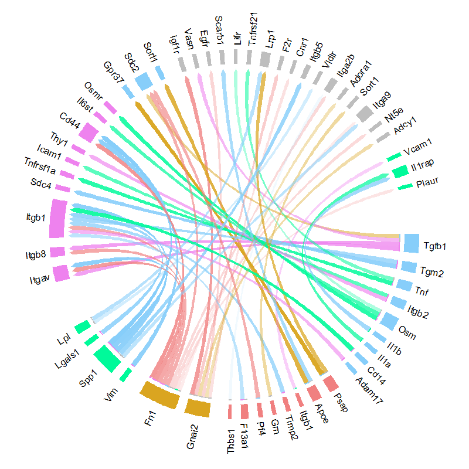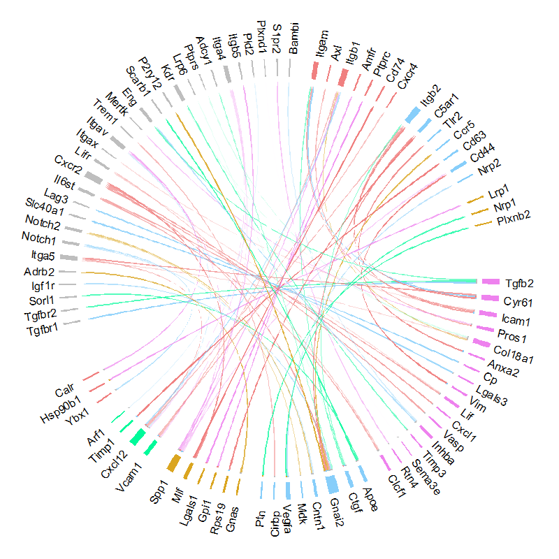
</div>


**Plot the LRloop network (users could also choose to plot the network in other softwares with the .csv files)**


``` r
# The function plotLRL creates two types of plots (3 figures) in which the nodes are denoted in forms of A_L1_R1 and B_L2_R2:
# the ones starting with an "A_" are "L1_R1" pairs and those starting with a "B_" are "L2_R2" pairs
# First run:
print_LRL_Score_options(LRloop_info_sub) # Print options for the variable "WhichL1R1L2R2Score" in function plotLRL

#> print_LRL_Score_options(LRloop_info_sub)
#[1] "L1R1L2R2_exprScore_mmP60"                 "L1R1L2R2_exprScore_mmNMDA03"              "L1R1L2R2_exprScore_mmNMDA06"              "L1R1L2R2_exprScore_mmNMDA12"              "L1R1L2R2_exprScore_mmNMDA24"             
#[6] "L1R1L2R2_exprScore_mmNMDA36"              "L1R1L2R2_exprScore_mmNMDA48"              "L1R1L2R2_exprScore_mmNMDA48FI"            "L1R1L2R2_exprScore_mmNMDA72"              "L1R1L2R2_exprScore_max"                  
#[11] "L1R1L2R2_exprScore_mean"                  "L1R1L2R2_logFC_Score_mmNMDA03_vs_mmP60"   "L1R1L2R2_logFC_Score_mmNMDA06_vs_mmP60"   "L1R1L2R2_logFC_Score_mmNMDA12_vs_mmP60"   "L1R1L2R2_logFC_Score_mmNMDA24_vs_mmP60"  
#[16] "L1R1L2R2_logFC_Score_mmNMDA36_vs_mmP60"   "L1R1L2R2_logFC_Score_mmNMDA48_vs_mmP60"   "L1R1L2R2_logFC_Score_mmNMDA48FI_vs_mmP60" "L1R1L2R2_logFC_Score_mmNMDA72_vs_mmP60"   "L1R1L2R2_logFC_Score_max"                
#[21] "L1R1L2R2_logFC_Score_mean"                "L1R1L2R2_maxlogFC_basedScore"             "L1R1L2R2_meanlogFC_basedScore"     
# Set colors for heatmaps:
my.breaks = c(seq(-3, 0, by=0.1), seq(0.1, 20, by=1)) 
pheatmapcolor = c(colorRampPalette(colors = c("gold", "dark orange"))(length(my.breaks)))

# Create plots:
plotLRL(LRloop_info = LRloop_info_sub, WhichL1R1L2R2Score = "L1R1L2R2_exprScore_max", 
        nodecolors = c("turquoise", "violet"), labelcolor = "black", nodesize = 3, edgecutoff = 0, labelsize = 0.7, edgecolor = 'orange', 
        pheatmapcolor = pheatmapcolor, pheatmap_dist = 'euclidean')

### Plot specified L1R1 and L2R2 scores across conditions of interest in heatmaps (if length(conditions) >= 2)
# Prepair the data
L1R1score_matrix = take_LR_expr_score(LRloop_info = LRloop_info_sub, LRpair = 'L1R1', LRL_filter = 'FALSE')
L2R2score_matrix = take_LR_expr_score(LRloop_info = LRloop_info_sub, LRpair = 'L2R2', LRL_filter = 'FALSE')

# Remark: We exact these LRscore matrices to plot heatmaps for all L1R1 and L2R2 pairs identified in our LRloop network in any condition.  
# However, it is possible that, for example, some L1R1 pair is identified in condition A (it has at least one expressed L2R2 partner forming an LRloop with it in condition A), 
# also expressed in condition B (such that its LRscore in condition B can be positive if it is caculated directly from the expression levels), but does not form any LRloop (has no expressed L2R2 partner) in condition B.  
# In this case, we can make these LRscores more condition-wise-LRloop-stringent and choose to set the LRscore of such L1R1 pair in condition B to 0 by setting LRL_filter = 'TRUE'.

#> head(L1R1score_matrix)
#            L1R1_exprscore_mmP60 L1R1_exprscore_mmNMDA03 L1R1_exprscore_mmNMDA06 L1R1_exprscore_mmNMDA12 L1R1_exprscore_mmNMDA24 L1R1_exprscore_mmNMDA36 L1R1_exprscore_mmNMDA48 L1R1_exprscore_mmNMDA48FI L1R1_exprscore_mmNMDA72
#Tgfb1_Itgav            0.7167340               0.8120926               0.7622898               0.7083325               0.6494934               0.7469073               0.7562082                 0.7286459               0.7872492
#Psap_Gpr37             0.8799245               0.8181433               0.7333510               0.7851982               0.8375811               0.8499107               0.8946244                 0.8953847               0.8864251
#Gnai2_Igf1r            0.7701655               0.7088867               0.5794166               0.7443428               0.7504177               0.8049272               0.8025737                 0.7820447               0.8252219
#Tgfb1_Sdc2             0.7277916               0.7173932               0.5838594               0.5497506               0.6416552               0.5972403               0.6547189                 0.6752535               0.6867804
#Apoe_Sorl1             0.7435300               0.7304094               0.6442803               0.4853939               0.6819413               0.7918724               0.8345925                 0.8085256               0.8490935
#Tgfb1_Itgb8            0.5776929               0.8226347               0.7900120               0.6648106               0.5966116               0.6692205               0.6958490                 0.6786757               0.7503173

  
```


``` r
### (Optional) Filter the LRloops, then collect and write the corresponding LRloop info again.
# Filter by user preferred LRloop_info based conditions: please check the .csv files from the last step with filenames like "LRloop ***.csv" or "L1R1L2R2 ***.csv" for filtering options:
# The names of the list LRloop_info and the .csv files created from the last step are consistent.
# LRloop expression.csv: The LRloop network, together with the average expression values of each gene and the detection rates of each gene in the corresponding cell types and each condition
# LRloopDEG.csv: Differential expresssion information of the genes in LRloop_network 
# L1R1L2R2 clusters.csv: User defined clusters of L1, R1, L2, R2, L1-R1 pairs and L2-R2 pairs
# LRloop expr_score.csv: The L1R1L2R2 LoopScore calculated based on valuse_ct1 and valuse_ct2
# LRloop logFC_score.csv: The L1R1L2R2 LoopScore calculated based on the absolute values of the logFC of L1, R1, L2 and R2 (the ones ended with "max" and "mean" are the maximum and mean value of the scores calulated from all the conditions pairs under comparison; the ones ended with "maxlogFC_basedScore" and "maxlogFC_basedScore" are calculated directly from the maximum and mean values of the logFC absolute values across all comparisons)
# LRloop nichenet_score.csv: The nichenet algorithm based scores of L1, R1, L2 and L2 in each L1R1L2R2 loop
# The column names of these .csv files should be self-explanatory
# Here as an example, we filter the LRloop_network by requiring:
# a) L1 and L2 are differentially expressed in some NMDA time point compared to control mmP60
# b) The L1_activityscore and the R1_activityscore calculated by nichenetr's algorithm are no less than 0.05
idx = which(LRloop_info$LRloopDEG[,'L1_diff'] == 'TRUE' & LRloop_info$LRloopDEG[,'L2_diff'] == 'TRUE' &
              as.numeric(LRloop_info$`LRloop nichenet_score`[,'L1_nichenetscore']) >= 0.05 & 
              as.numeric(LRloop_info$`LRloop nichenet_score`[,'R1_nichenetscore']) >= 0.05)
LRloop_network_sub = LRloop_network[idx,]
LRloop_info_sub = LRL_info_collection(LRloop_network = LRloop_network_sub, # Note that compared to the first time running the function "LRL_info_collection", this is the only variable needs to be changed
                                      LRL_eachcondition = Basics$myLRL$eachcondition,
                                      valuse_ct1 = Basics$ave_expr_ct1, valuse_ct2 = Basics$ave_expr_ct2, scalar = overallaveexprm, 
                                      ScoreConditionIdx = c(1,2,3,4,5,6,7,9), 
                                      LRscore_method = 'scsigr', LoopScore_method = "ave_geo",
                                      LRlfcscore_method = "mean", LooplfcScore_method = 'ave_ari',
                                      DEGinfo_ct1 = DEGinfo_ct1, DEGinfo_ct2 = DEGinfo_ct2,
                                      genes_cluster_ct1 = genes_cluster_ct1, genes_cluster_ct2 = genes_cluster_ct2, 
                                      L1R1_cluster = L1R1_cluster, L2R2_cluster = L2R2_cluster,
                                      ave_expr_ct1 = Basics$ave_expr_ct1, ave_expr_ct2 = Basics$ave_expr_ct2,
                                      pct_expr_ct1 = Basics$pct_expr_ct1, pct_expr_ct2 = Basics$pct_expr_ct2,
                                      ligand_activities_matrix_ct1_to_ct2 = Basics$ligand_activities_matrix_ct1_to_ct2, 
                                      receptor_activities_matrix_ct1_to_ct2 = Basics$receptor_activities_matrix_ct1_to_ct2,
                                      ligand_activities_matrix_ct2_to_ct1 = Basics$ligand_activities_matrix_ct2_to_ct1,
                                      receptor_activities_matrix_ct2_to_ct1 = Basics$receptor_activities_matrix_ct2_to_ct1)
filedir2 = "ExampleData/outputs_filtered/"
writeLRL(LRloop_info_sub, filedir2)

### Let's have a look at some most basic info about the identified ligand-receptor pairs
MostBasicLRinfo(LRloop_info = LRloop_info_sub)
#[1] "Number of L1-R1 pairs:"
#[1] 52
#[1] "Number of L1:"
#[1] 23
#[1] "Number of R1:"
#[1] 33
#[1] "Number of L2-R2 pairs:"
#[1] 73
#[1] "Number of L2:"
#[1] 38
#[1] "Number of R2:"
#[1] 47
#[1] "Ligands L1:"
#[1] "Tgfb1"  "Psap"   "Gnai2"  "Apoe"   "Tgm2"   "Tnf"    "Itgb2"  "Vim"    "Osm"    "Itgb1"  "Il1b"   "Spp1"   "Timp2"  "Il1a"   "Fn1"    "Lgals1" "Cd14"   "Lpl"    "Adam17" "Grn"    "Pf4"    "F13a1"  "Thbs1" 
#[1] "Receptors R1:"
#[1] "Itgav"    "Gpr37"    "Igf1r"    "Sdc2"     "Sorl1"    "Itgb8"    "Vasn"     "Itgb1"    "Sdc4"     "Tnfrsf1a" "Icam1"    "Egfr"     "Thy1"     "Cd44"     "Il6st"    "Osmr"     "Vcam1"    "Scarb1"   "Il1rap"   "Lifr"     "Plaur"    "Tnfrsf21" "Lrp1"    
#[24] "F2r"      "Cnr1"     "Itgb5"    "Vldlr"    "Itga2b"   "Adora1"   "Sort1"    "Itga9"    "Nt5e"     "Adcy1"   
#[1] "Ligands L2:"
#[1] "Tgfb2"   "Apoe"    "Ctgf"    "Cyr61"   "Gnai2"   "Gnas"    "Icam1"   "Rps19"   "Pros1"   "Col18a1" "Gpi1"    "Vcam1"   "Anxa2"   "Cntn1"   "Cp"      "Cxcl12"  "Lgals1"  "Lgals3"  "Mdk"     "Mif"     "Timp1"   "Vim"     "Ybx1"    "Lif"     "Vegfa"  
#[26] "Cxcl1"   "Hsp90b1" "Calr"    "Cirbp"   "Vasp"    "Ptn"     "Inhba"   "Timp3"   "Spp1"    "Arf1"    "Sema3e"  "Rtn4"    "Clcf1"  
#[1] "Receptors R2:"
#[1] "Tgfbr1"  "Tgfbr2"  "Sorl1"   "Itgam"   "Igf1r"   "Adrb2"   "Itgb2"   "C5ar1"   "Axl"     "Itga5"   "Itgb1"   "Amfr"    "Tlr2"    "Notch1"  "Notch2"  "Slc40a1" "Ccr5"    "Ptprc"   "Lag3"    "Cd74"    "Cd63"    "Cd44"    "Il6st"   "Nrp2"    "Cxcr2"  
#[26] "Lifr"    "Lrp1"    "Itgax"   "Itgav"   "Trem1"   "Mertk"   "Eng"     "Cxcr4"   "Nrp1"    "Scarb1"  "P2ry12"  "Plxnb2"  "Kdr"     "Lrp6"    "Ptprs"   "Adcy1"   "Itga4"   "Itgb5"   "Pld2"    "Plxnd1"  "S1pr2"   "Bambi"  


```

<div align="center">
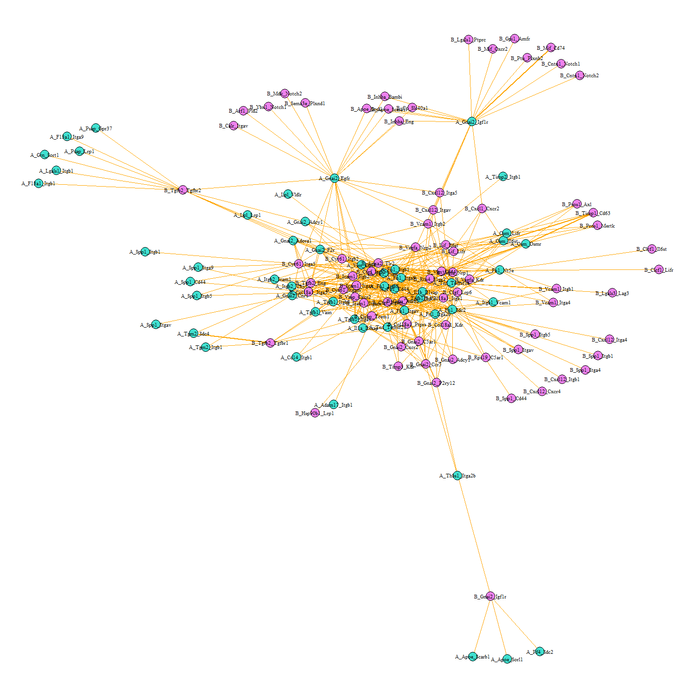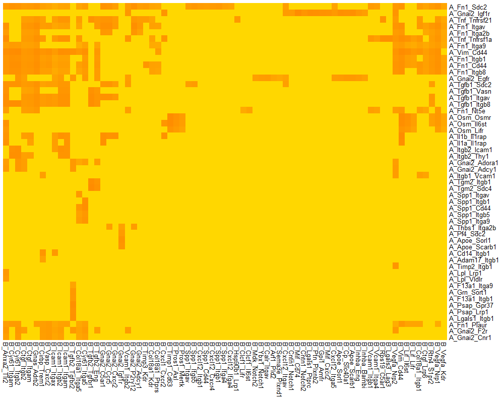
</div>


**Pheatmap plots**

Plot specified L1R1 and L2R2 scores across conditions of interest in heatmaps (if length(conditions) >= 2)


Prepair the data:
``` r
L1R1score_matrix = take_LR_expr_score(LRloop_info = LRloop_info_sub, LRpair = 'L1R1', LRL_filter = 'FALSE')
L2R2score_matrix = take_LR_expr_score(LRloop_info = LRloop_info_sub, LRpair = 'L2R2', LRL_filter = 'FALSE')

# Remark: We exact these LRscore matrices to plot heatmaps for all L1R1 and L2R2 pairs identified in our LRloop network in any condition.  
# However, it is possible that, for example, some L1R1 pair is identified in condition A (it has at least one expressed L2R2 partner forming an LRloop with it in condition A), 
# also expressed in condition B (such that its LRscore in condition B can be positive if it is caculated directly from the expression levels), but does not form any LRloop (has no expressed L2R2 partner) in condition B.  
# In this case, we can make these LRscores more condition-wise-LRloop-stringent and choose to set the LRscore of such L1R1 pair in condition B to 0 by setting LRL_filter = 'TRUE'.

#> head(L1R1score_matrix)
#            L1R1_exprscore_mmP60 L1R1_exprscore_mmNMDA03 L1R1_exprscore_mmNMDA06 L1R1_exprscore_mmNMDA12 L1R1_exprscore_mmNMDA24 L1R1_exprscore_mmNMDA36 L1R1_exprscore_mmNMDA48 L1R1_exprscore_mmNMDA48FI L1R1_exprscore_mmNMDA72
#Tgfb1_Itgav            0.7167340               0.8120926               0.7622898               0.7083325               0.6494934               0.7469073               0.7562082                 0.7286459               0.7872492
#Psap_Gpr37             0.8799245               0.8181433               0.7333510               0.7851982               0.8375811               0.8499107               0.8946244                 0.8953847               0.8864251
#Gnai2_Igf1r            0.7701655               0.7088867               0.5794166               0.7443428               0.7504177               0.8049272               0.8025737                 0.7820447               0.8252219
#Tgfb1_Sdc2             0.7277916               0.7173932               0.5838594               0.5497506               0.6416552               0.5972403               0.6547189                 0.6752535               0.6867804
#Apoe_Sorl1             0.7435300               0.7304094               0.6442803               0.4853939               0.6819413               0.7918724               0.8345925                 0.8085256               0.8490935
#Tgfb1_Itgb8            0.5776929               0.8226347               0.7900120               0.6648106               0.5966116               0.6692205               0.6958490                 0.6786757               0.7503173

# (Optional) Take the columns of interest in preferred order and modify the column names
L1R1score_matrix = L1R1score_matrix[,c(1,2,3,4,5,6,7,9)]
colnames(L1R1score_matrix) = conditions[c(1,2,3,4,5,6,7,9)]
L2R2score_matrix = L2R2score_matrix[,c(1,2,3,4,5,6,7,9)]
colnames(L2R2score_matrix) = conditions[c(1,2,3,4,5,6,7,9)]

#> head(L1R1score_matrix)
#                mmP60  mmNMDA03  mmNMDA06  mmNMDA12  mmNMDA24  mmNMDA36  mmNMDA48  mmNMDA72
#Tgfb1_Itgav 0.7167340 0.8120926 0.7622898 0.7083325 0.6494934 0.7469073 0.7562082 0.7872492
#Psap_Gpr37  0.8799245 0.8181433 0.7333510 0.7851982 0.8375811 0.8499107 0.8946244 0.8864251
#Gnai2_Igf1r 0.7701655 0.7088867 0.5794166 0.7443428 0.7504177 0.8049272 0.8025737 0.8252219
#Tgfb1_Sdc2  0.7277916 0.7173932 0.5838594 0.5497506 0.6416552 0.5972403 0.6547189 0.6867804
#Apoe_Sorl1  0.7435300 0.7304094 0.6442803 0.4853939 0.6819413 0.7918724 0.8345925 0.8490935
#Tgfb1_Itgb8 0.5776929 0.8226347 0.7900120 0.6648106 0.5966116 0.6692205 0.6958490 0.7503173

# pheatmap plots
my.breaks = c(seq(-3, 0, by=0.1), seq(0.1, 20, by=5)) 
my.colors = c(colorRampPalette(colors = c("white", "red"))(length(my.breaks)/2), 
              colorRampPalette(colors = c("red","darkred"))(length(my.breaks)/2))
pheatmap(L1R1score_matrix, scale = 'row', cluster_cols = FALSE, cluster_rows = TRUE, show_rownames = T, color = my.colors,
         legend = TRUE, treeheight_row = 0, border_color = FALSE, fontsize_row = 6)
pheatmap(L1R1score_matrix, scale = 'none', cluster_cols = FALSE, cluster_rows = TRUE, show_rownames = T, color = my.colors,
         legend = TRUE, treeheight_row = 0, border_color = FALSE, fontsize_row = 6)
pheatmap(L2R2score_matrix, scale = 'row', cluster_cols = FALSE, cluster_rows = TRUE, show_rownames = T, color = my.colors,
         legend = TRUE, treeheight_row = 0, border_color = FALSE, fontsize_row = 6)
pheatmap(L2R2score_matrix, scale = 'none', cluster_cols = FALSE, cluster_rows = TRUE, show_rownames = T, color = my.colors,
         legend = TRUE, treeheight_row = 0, border_color = FALSE, fontsize_row = 6)


#Remark: Example figures are save in "ExampleData/outputs_filtered/"
```


<div align="center">
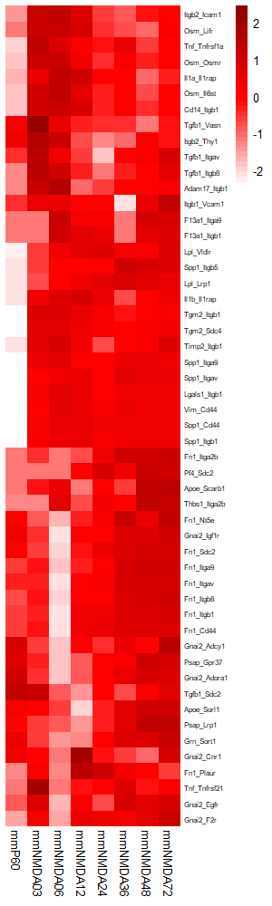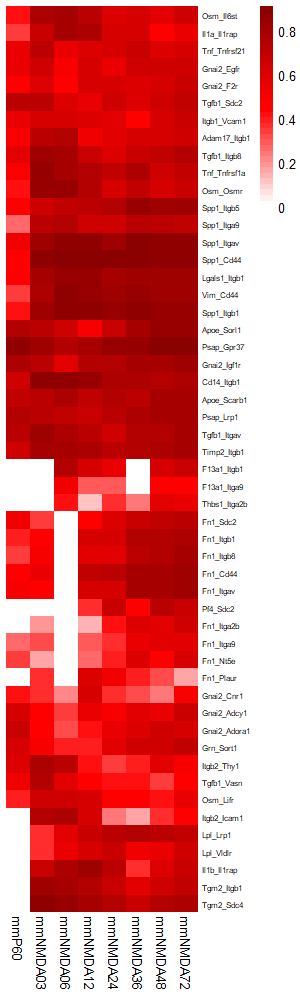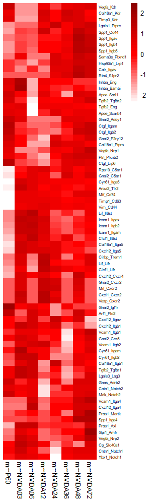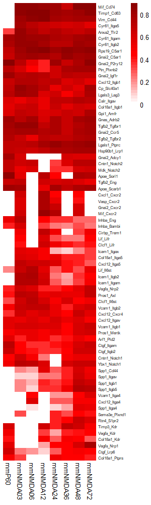
</div>


**Use LRLoop as a scoring factor**

``` r
LRloops = Basics$allLRL$`R1->L2_R2->L1`
#> head(LRloops)
#     L2      R2       L1         R1     
#[1,] "Tgfb2" "Tgfbr1" "Tgfb1"    "Itgav"
#[2,] "Tgfb2" "Tgfbr1" "Tgfb1"    "Itgb8"
#[3,] "Tgfb2" "Tgfbr1" "Tgfb1"    "Vasn" 
#[4,] "Tgfb2" "Tgfbr1" "Tgm2"     "Itgb1"
#[5,] "Tgfb2" "Tgfbr1" "Tgm2"     "Sdc4" 
#[6,] "Tgfb2" "Tgfbr1" "Serpine1" "Lrp1"
#> dim(LRloops)
#[1] 1329    4
```

``` r
### ct1 to ct2 ####
### Specify candidate LR pairs from ct1 to ct2.
L1R1pairs = Basics$lr_expr_ct1_to_ct2$bind
#> head(L1R1pairs)
#     from    to     
#[1,] "Cntn1" "Nrcam"
#[2,] "Cadm1" "Cadm1"
#[3,] "Negr1" "Negr1"
#[4,] "Vtn"   "Itgav"
#[5,] "Vtn"   "Itgb5"
#[6,] "Igf1"  "Igf1r"
#> dim(L1R1pairs)
#[1] 213   2

### Calculate L1R1 scores.
# Specify LRscores to be used from ct1 to ct2 and from ct2 to ct1, in this example, we use scsigr score calculated based on the average expression values.
L1R1scores = get_LRscores(lr_expr = L1R1pairs, conditions = conditions,
                          value.use_from = Basics$ave_expr_ct1, value.use_to = Basics$ave_expr_ct2,
                          scalar = overallaveexprm, LRscore_method = 'scsigr',
                          thresh_expr_from = Basics$thresh_expr_ct1, thresh_expr_to = Basics$thresh_expr_ct2, thresh_expr_cut = FALSE,
                          LRL_eachcondition = Basics$myLRL$eachcondition, LRL_filter = 'none')
#> head(L1R1scores)
#     from    to      mmP60               mmNMDA03            mmNMDA06            mmNMDA12            mmNMDA24            mmNMDA36            mmNMDA48            mmNMDA48FI          mmNMDA72           
#[1,] "Cntn1" "Nrcam" "0.700875949564521" "0.421899538729416" "0"                 "0"                 "0"                 "0.439953572661513" "0.386924637006801" "0.381820284661351" "0.164722835765612"
#[2,] "Cadm1" "Cadm1" "0.837837903885129" "0.836832042750149" "0.826856069285421" "0.843870934371788" "0.801584027354358" "0.81842076770425"  "0.811217034401163" "0.774025099109966" "0.806843973425742"
#[3,] "Negr1" "Negr1" "0.74836885595467"  "0.274150993205106" "0.357526455903131" "0"                 "0.348342170937864" "0.383991067120397" "0.277286910370301" "0.236749018933602" "0.224390923657688"
#[4,] "Vtn"   "Itgav" "0.720337468653989" "0.761382700046915" "0.781760361274263" "0.749407138949124" "0.648311455923783" "0.755421130422588" "0.716382339902723" "0.620057544015233" "0.695830983638457"
#[5,] "Vtn"   "Itgb5" "0.679236095429675" "0.569209173911564" "0.564360896574841" "0.533313398662959" "0.514333498614948" "0.666463571454103" "0.624268666392938" "0.522903284832386" "0.567473065827716"
#[6,] "Igf1"  "Igf1r" "0.735677425105909" "0.457142015793351" "0"                 "0.328033574092079" "0.28576613285034"  "0.751907754733162" "0.723709627196896" "0.518187031914579" "0.802080634951742"
#> dim(L1R1scores)
#[1] 213  11
L2R2corrector = get_LRscores(lr_expr = lr_network, conditions = conditions,
                             value.use_from = Basics$ave_expr_ct2, value.use_to = Basics$ave_expr_ct1,
                             scalar = overallaveexprm, LRscore_method = 'scsigr',
                             thresh_expr_from = Basics$thresh_expr_ct2, thresh_expr_to = Basics$thresh_expr_ct1, thresh_expr_cut = TRUE,
                             LRL_eachcondition = Basics$myLRL$eachcondition, LRL_filter = 'none')
#> head(L2R2corrector)
#     from     to      mmP60 mmNMDA03 mmNMDA06 mmNMDA12            mmNMDA24 mmNMDA36 mmNMDA48 mmNMDA48FI mmNMDA72
#[1,] "Cxcl1"  "Cxcr2" "0"   "0"      "0"      "0.774030906933947" "0"      "0"      "0"      "0"        "0"     
#[2,] "Cxcl2"  "Cxcr2" "0"   "0"      "0"      "0.805606925756403" "0"      "0"      "0"      "0"        "0"     
#[3,] "Cxcl5"  "Cxcr2" "0"   "0"      "0"      "0"                 "0"      "0"      "0"      "0"        "0"     
#[4,] "Ppbp"   "Cxcr2" "0"   "0"      "0"      "0"                 "0"      "0"      "0"      "0"        "0"     
#[5,] "Cxcl9"  "Cxcr3" "0"   "0"      "0"      "0"                 "0"      "0"      "0"      "0"        "0"     
#[6,] "Cxcl10" "Cxcr3" "0"   "0"      "0"      "0"                 "0"      "0"      "0"      "0"        "0"  
#> dim(L2R2corrector)
#[1] 2246   11

# Remark: If NicheNet scores, instead of expression based scores, are preferred, take them directly from Basics:
#L1R1scores = takeNicheNetScores(LRpairs = L1R1pairs, from_to = 'ct1_to_ct2', 
#                                Basics = Basics, nichenetscore = 'pearson', method = 'Ligand')
#L2R2corrector = takeNicheNetScores(LRpairs = lr_network, from_to = 'ct2_to_ct1', 
#                                   Basics = Basics, nichenetscore = 'pearson', method = 'Ligand')
# Remark: L1R1scores and L2R2corrector should have the same column names and the first two columns should be "from" and "to".


# Update L1R1scores with LRloops by L2R2corrector.
L1R1scoresUpdated = updateLRscores(LRS = L1R1scores, LRC = L2R2corrector, LRloops = LRloops, from_to = 'ct1_to_ct2', LRCform = 'max', 
                                   lambda = 0.9, mu = 0.8, k = 2)
# from_to: Specifies if the LRpairs in LRS are expressed from ct1 to ct2 or from ct2 to ct1.  Options are "ct1_to_ct2" or "ct2_to_ct1". 
# If from_to == "ct1_to_ct2", LRS stores the LRpairs expressed from ct1 to ct2 and their LRscores.  
# If from_to == "ct2_to_ct1", LRS stores the LRpairs expressed from ct2 to ct1 and their LRscores.
# LRCform: If an LRpair in LRS has multiple LRloop-partners in LRloops, it specifies how to get a single corrector score for it from the LRscores of these LRloop-partners in LRC.
#          Options are "max", "mean" and "sum".
# lambda, mu, k: Formula parameters in the function L1R1L2R2ScoreHill.
#> head(L1R1scoresUpdated)
#     from    to      mmP60               mmNMDA03            mmNMDA06            mmNMDA12            mmNMDA24            mmNMDA36            mmNMDA48            mmNMDA48FI          mmNMDA72            cond_max            cond_mean           twowaymax           twowaymean         
#[1,] "Cntn1" "Nrcam" "0.700875949564521" "0.421899538729416" "0"                 "0"                 "0"                 "0.439953572661513" "0.386924637006801" "0.381820284661351" "0.164722835765612" "0.700875949564521" "0.277355202043246" "0.700875949564521" "0.277355202043246"
#[2,] "Cadm1" "Cadm1" "1.2322760897571"   "1.23034526247955"  "1.21122268728034"  "1.24386721365786"  "1.16301035627373"  "1.19509272151415"  "1.18134726006165"  "1.11084370756466"  "1.17301661103224"  "1.24386721365786"  "1.19344687884681"  "1.24386721365786"  "1.19333169188689" 
#[3,] "Negr1" "Negr1" "0.74836885595467"  "0.274150993205106" "0.357526455903131" "0"                 "0.348342170937864" "0.383991067120397" "0.277286910370301" "0.236749018933602" "0.224390923657688" "0.74836885595467"  "0.316756266231418" "0.74836885595467"  "0.316756266231418"
#[4,] "Vtn"   "Itgav" "0.720337468653989" "0.761382700046915" "0.781760361274263" "0.749407138949124" "0.648311455923783" "0.755421130422588" "0.716382339902723" "0.620057544015233" "0.695830983638457" "0.781760361274263" "0.716543458091897" "0.781760361274263" "0.716543458091897"
#[5,] "Vtn"   "Itgb5" "0.679236095429675" "0.569209173911564" "0.564360896574841" "0.533313398662959" "0.514333498614948" "0.666463571454103" "0.624268666392938" "0.522903284832386" "0.567473065827716" "0.679236095429675" "0.582395739077903" "0.679236095429675" "0.582395739077903"
#[6,] "Igf1"  "Igf1r" "1.03447741275343"  "0.666736677861352" "0"                 "0.489251999829571" "0.418389479738527" "1.11795885963515"  "1.07138666189375"  "0.768066140365132" "1.1879045151201"   "1.1879045151201"   "0.750463527466335" "1.1962786302007"   "0.752451193448286"
#> dim(L1R1scoresUpdated)
#[1] 213  15

### Select a column in L1R1scoresUpdated and rank the ligand-receptor pairs from ct1 to ct2.
print(colnames(L1R1scoresUpdated)[3:ncol(L1R1scoresUpdated)]) # This shows the column name options.
#[1] "mmP60"      "mmNMDA03"   "mmNMDA06"   "mmNMDA12"   "mmNMDA24"   "mmNMDA36"   "mmNMDA48"   "mmNMDA48FI" "mmNMDA72"   "cond_max"   "cond_mean"  "twowaymax"  "twowaymean"
myscore = 'cond_max'
myorder = order(as.numeric(L1R1scoresUpdated[,myscore]),decreasing=TRUE)
L1R1scoresUpdated = L1R1scoresUpdated[myorder,]
L1R1scores = L1R1scores[myorder,]

# Write these scores in .csv files.
filedir_score = "ExampleData/outputs_LRloopScoring/"
write.csv(L1R1scores, file = sprintf("%s/%s.csv", filedir_score, "L1R1scores_original"), row.names = FALSE)
write.csv(L1R1scoresUpdated, file = sprintf("%s/%s.csv", filedir_score, "L1R1scores_LRloopModified"), row.names = FALSE)

# Collect LRLoop partner info of L1R1 pairs and write in .csv files
L1R1LRLoopPartnerInfo = getLRLoopPartnerInfo(LRpairs = L1R1scoresUpdated[,c('from','to')], from_to = 'ct1_to_ct2', LRLoop_network = LRloops)
write.csv(L1R1LRLoopPartnerInfo, file = sprintf("%s/%s.csv", filedir_score, "L1R1LRLoopPartnerInfo"), row.names = FALSE)

### Calculate an L1R1scoresUpdated-cutoff.
# Modify L1R1scores with random LRloops by L2R2corrector.
L1R1scoresUpdated_nrand = updateLRscores_rand(n = 50, lr_ct1_to_ct2 = Basics$lr_expr_ct1_to_ct2$bind, lr_ct2_to_ct1 = Basics$lr_expr_ct2_to_ct1$bind, 
                                              LRloops = LRloops, 
                                              LRS = L1R1scores, LRC = L2R2corrector, from_to = "ct1_to_ct2", LRCform = 'max', lambda = 0.9, mu = 0.8, k = 2)
# n: Number of randomization rounds.
# lr_ct1_to_ct2: A matrix with columns "from" and "to" of ligand-receptor pairs from ct1 to ct2.
# lr_ct2_to_ct1: A matrix with columns "from" and "to" of ligand-receptor pairs from ct2 to ct1.
#> head(L1R1scoresUpdated_nrand)
#     from    to      mmP60               mmNMDA03            mmNMDA06            mmNMDA12            mmNMDA24            mmNMDA36            mmNMDA48            mmNMDA48FI          mmNMDA72            cond_max            cond_mean           twowaymax           twowaymean         
#[1,] "Cntn1" "Nrcam" "0.700875949564521" "0.421899538729416" "0"                 "0"                 "0"                 "0.439953572661513" "0.386924637006801" "0.381820284661351" "0.164722835765612" "0.700875949564521" "0.277355202043246" "0.700875949564521" "0.277355202043246"
#[2,] "Cadm1" "Cadm1" "0.837837903885129" "0.836832042750149" "0.826856069285421" "0.843870934371788" "0.801584027354358" "0.81842076770425"  "0.811217034401163" "0.774025099109966" "0.806843973425742" "0.843870934371788" "0.817498650254218" "0.843870934371788" "0.817498650254218"
#[3,] "Negr1" "Negr1" "0.74836885595467"  "0.274150993205106" "0.357526455903131" "0"                 "0.348342170937864" "0.383991067120397" "0.277286910370301" "0.236749018933602" "0.224390923657688" "0.74836885595467"  "0.316756266231418" "0.74836885595467"  "0.316756266231418"
#[4,] "Vtn"   "Itgav" "0.720337468653989" "1.11785211987574"  "1.15330848287674"  "1.09497034552964"  "0.895113334498058" "1.04349816469067"  "1.02165834463398"  "0.891064207640196" "0.993173701315845" "1.15330848287674"  "0.992330685523873" "1.15330848287674"  "0.989438239265178"
#[5,] "Vtn"   "Itgb5" "0.679236095429675" "0.569209173911564" "0.564360896574841" "0.533313398662959" "0.514333498614948" "0.666463571454103" "0.624268666392938" "0.522903284832386" "0.567473065827716" "0.679236095429675" "0.582395739077903" "0.679236095429675" "0.582395739077903"
#[6,] "Igf1"  "Igf1r" "1.04326921969364"  "0.670172302894301" "0"                 "0.485654143814864" "0.38489710602907"  "0.958113960448977" "0.961087699889078" "0.706069620308521" "1.0979691765403"   "1.0979691765403"   "0.700803692179861" "1.18748144947086"  "0.713522380360411"
#> dim(L1R1scoresUpdated_nrand)
#[1] 10650    15

# Calculate the L1R1scoresUpdated-cutoff for its myscore-column based on the distribution of the scores in the myscore-column of L1R1scoresUpdated_nrand.
getLRscoreupdated_cutoff(p_value = 0.1, LRscores_LRL = L1R1scoresUpdated, LRscores_randLRL = L1R1scoresUpdated_nrand, myscore_col = myscore)
#     90% 
#1.161871 
#The density plot is saved in "ExampleData/outputs_LRloopScoring/"

# Keep the L1R1 pairs with the scores in the myscore-column of L1R1scoresUpdated above a user specified cutoff.
cutoff = 1.16 # Users can also specify any preferred cutoff value here.
L1R1scoresUpdated_top = L1R1scoresUpdated[as.numeric(L1R1scoresUpdated[,myscore])>=cutoff,]
#> head(L1R1scoresUpdated_top)
#     from   to      mmP60               mmNMDA03            mmNMDA06            mmNMDA12           mmNMDA24            mmNMDA36            mmNMDA48            mmNMDA48FI          mmNMDA72            cond_max           cond_mean           twowaymax          twowaymean         
#[1,] "Vim"  "Cd44"  "0.509400177192289" "1.14211426858565"  "1.30855034677979"  "1.27231653324804" "1.18540553855537"  "1.21556429044833"  "1.21160409530073"  "1.24374159177117"  "1.20776938914156"  "1.30855034677979" "1.14405180344699"  "1.3168801835366"  "1.14408812510997" 
#[2,] "Ccl5" "Sdc4"  "0"                 "1.28609668770134"  "0.814041566617591" "0"                "1.08770960017104"  "0.931479456835739" "1.0073793014042"   "1.19636921765523"  "0.782070338450937" "1.28609668770134" "0.789460685426231" "1.30296943487283" "0.789858701150379"
#[3,] "Tgm2" "Sdc4"  "0"                 "1.28085190969659"  "1.25145533467368"  "1.09532480602949" "1.07229867171531"  "0.924434747509901" "1.04947205673708"  "1.06686846599335"  "1.11083739858847"  "1.28085190969659" "0.983504821215986" "1.28085190969659" "0.984117196507901"
#[4,] "Spp1" "Cd44"  "0.452848612582619" "1.24854657886234"  "1.27503607789836"  "1.23473901115702" "1.19500156019666"  "1.19561887895829"  "1.18583361771879"  "1.16998186269869"  "0.881513114045124" "1.27503607789836" "1.09323547934643"  "1.31454207423201" "1.06248958124095" 
#[5,] "Psap" "Gpr37" "1.24971056168656"  "0.818143269362037" "0.733351028284018" "1.09245713208515" "1.15978328460145"  "1.1794177844623"   "1.2579204433681"   "1.24727667412246"  "1.26389250531184"  "1.26389250531184" "1.11132807592043"  "1.27666746348998" "1.09060705972237" 
#[6,] "Osm"  "Osmr"  "0.418258886105952" "1.26257182579908"  "1.26306744767775"  "1.09694184887076" "0.901253363414051" "1.01142742822252"  "0.913752539640484" "0.912446881687737" "0.990622406024079" "1.26306744767775" "0.974482514160268" "1.27755975490267" "0.960149571218363"
#> dim(L1R1scoresUpdated_top)
#[1] 28 15
```


``` r
### ct2 to ct1 ####
### Similar to the ct1-to-ct2 case.
L2R2pairs = Basics$lr_expr_ct2_to_ct1$bind

L2R2scores = get_LRscores(lr_expr = L2R2pairs, conditions = conditions,
                          value.use_from = Basics$ave_expr_ct2, value.use_to = Basics$ave_expr_ct1,
                          scalar = overallaveexprm, LRscore_method = 'scsigr',
                          thresh_expr_from = Basics$thresh_expr_ct2, thresh_expr_to = Basics$thresh_expr_ct1, thresh_expr_cut = FALSE,
                          LRL_eachcondition = Basics$myLRL$eachcondition, LRL_filter = 'none')
L1R1corrector = get_LRscores(lr_expr = lr_network, conditions = conditions,
                             value.use_from = Basics$ave_expr_ct1, value.use_to = Basics$ave_expr_ct2,
                             scalar = overallaveexprm, LRscore_method = 'scsigr',
                             thresh_expr_from = Basics$thresh_expr_ct1, thresh_expr_to = Basics$thresh_expr_ct2, thresh_expr_cut = TRUE,
                             LRL_eachcondition = Basics$myLRL$eachcondition, LRL_filter = 'none')

L2R2scoresUpdated = updateLRscores(LRS = L2R2scores, LRC = L1R1corrector, LRloops = LRloops, from_to = 'ct2_to_ct1', LRCform = 'max', 
                                   lambda = 0.9, mu = 0.8, k = 2)

print(colnames(L2R2scoresUpdated)[3:ncol(L2R2scoresUpdated)]) 
myscore = 'cond_max'
myorder = order(as.numeric(L2R2scoresUpdated[,myscore]),decreasing=TRUE)
L2R2scoresUpdated = L2R2scoresUpdated[myorder,]
L2R2scores = L2R2scores[myorder,]

filedir_score = "ExampleData/outputs_LRloopScoring/"
write.csv(L2R2scores, file = sprintf("%s/%s.csv", filedir_score, "L2R2scores_original"), row.names = FALSE)
write.csv(L2R2scoresUpdated, file = sprintf("%s/%s.csv", filedir_score, "L2R2scores_LRloopModified"), row.names = FALSE)

L2R2LRLoopPartnerInfo = getLRLoopPartnerInfo(LRpairs = L2R2scoresUpdated[,c('from','to')], from_to = 'ct2_to_ct1', LRLoop_network = LRloops)
write.csv(L2R2LRLoopPartnerInfo, file = sprintf("%s/%s.csv", filedir_score, "L2R2LRLoopPartnerInfo"), row.names = FALSE)

L2R2scoresUpdated_nrand = updateLRscores_rand(n = 50, lr_ct1_to_ct2 = Basics$lr_expr_ct1_to_ct2$bind, lr_ct2_to_ct1 = Basics$lr_expr_ct2_to_ct1$bind, 
                                              LRloops = LRloops, 
                                              LRS = L2R2scores, LRC = L1R1corrector, from_to = "ct2_to_ct1", LRCform = 'max', lambda = 0.9, mu = 0.8, k = 2)

getLRscoreupdated_cutoff(p_value = 0.1, LRscores_LRL = L2R2scoresUpdated, LRscores_randLRL = L2R2scoresUpdated_nrand, myscore_col = myscore)
#     90% 
#1.147031

cutoff = 1.147 
L2R2scoresUpdated_top = L2R2scoresUpdated[as.numeric(L2R2scoresUpdated[,myscore])>=cutoff,]

```


``` r
### L1R1 
myscores = L1R1scores[1:50,] # This matrix is up to user's choice.  For example, one can also use L1R1scoresUpdated_top[,1:11].

# In this example, we cluster L1R1 pairs based the existence of expressed L2R2 LRLoop partners of them. 
L1R1linked = sprintf("%s_%s", L1R1LRLoopPartnerInfo[,'from'], L1R1LRLoopPartnerInfo[,'to'])
L1R1_cluster = (L1R1LRLoopPartnerInfo[,'num_LRLoopPartner']!='0')*1
names(L1R1_cluster) = L1R1linked 
#> head(L1R1_cluster)
#Vim_Cd44  Ccl5_Sdc4  Tgm2_Sdc4  Spp1_Cd44 Psap_Gpr37   Osm_Osmr 
#1          1          1          1          1          1

# pheatmap plots
L1R1score_matrix = myscores
rownames(L1R1score_matrix) = sprintf("%s_%s", L1R1score_matrix[,'from'], L1R1score_matrix[,'to'])
L1R1score_matrix = L1R1score_matrix[,conditions]
mode(L1R1score_matrix) = 'numeric'
#> head(L1R1score_matrix)
#               mmP60  mmNMDA03  mmNMDA06  mmNMDA12  mmNMDA24  mmNMDA36  mmNMDA48 mmNMDA48FI  mmNMDA72
#Vim_Cd44   0.3489221 0.7754652 0.8825481 0.8526824 0.8205393 0.8488767 0.8333794  0.8478973 0.8269288
#Ccl5_Sdc4  0.0000000 0.8732254 0.5479649 0.0000000 0.7457572 0.6264869 0.6852548  0.8071480 0.5280588
#Tgm2_Sdc4  0.0000000 0.8689238 0.8536282 0.7950476 0.7496140 0.6760279 0.7405975  0.7533807 0.7716924
#Spp1_Cd44  0.4528486 0.8640509 0.9097228 0.9089610 0.8896079 0.8970266 0.8843728  0.8948476 0.8815131
#Psap_Gpr37 0.8799245 0.8181433 0.7333510 0.7851982 0.8375811 0.8499107 0.8946244  0.8953847 0.8864251
#Osm_Osmr   0.4182589 0.8506777 0.8410278 0.7342598 0.6166621 0.7045089 0.6295097  0.6184032 0.6681023

my.breaks = c(seq(-3, 0, by=0.1), seq(0.1, 20, by=5)) 
my.colors = c(colorRampPalette(colors = c("white", "red"))(length(my.breaks)/2), 
              colorRampPalette(colors = c("red","darkred"))(length(my.breaks)/2))
pheatmap(L1R1score_matrix, scale = 'row', cluster_cols = FALSE, cluster_rows = TRUE, show_rownames = T, color = my.colors,
         legend = TRUE, treeheight_row = 0, border_color = FALSE, fontsize_row = 6)
pheatmap(L1R1score_matrix, scale = 'none', cluster_cols = FALSE, cluster_rows = TRUE, show_rownames = T, color = my.colors,
         legend = TRUE, treeheight_row = 0, border_color = FALSE, fontsize_row = 6)

# Circos plot
color_L = c("gray","lightcoral","violet","mediumspringgreen","lightskyblue","goldenrod")
names(color_L) = c("0", "1", "2", "3", "4", "5")
color_R = c("gray","lightcoral","violet","mediumspringgreen","lightskyblue","goldenrod")
names(color_R) = c("0", "1", "2", "3", "4", "5")
color_LR = c("gray","lightskyblue")
names(color_LR) = c("0", "1")

CircosPlot2(LRscorematrix = myscores, LRscore_conditions = conditions[2:9], WhichLRscore = 'LRscore_max',
            L_cluster = genes_cluster_ct1, R_cluster = genes_cluster_ct2, LR_cluster = L1R1_cluster, 
            color_L = color_L, color_R = color_R, color_LR = color_LR,
            width_same_ligand_cluster = 3, width_different_ligand_cluster = 6, width_ligand_receptor = 15, width_same_receptor_cluster = 3, width_different_receptor_cluster = 6,
            cplotthresh = 0, cex = 1)

### L2R2 
myscores = L2R2scores[1:50,] 

L2R2linked = sprintf("%s_%s", L2R2LRLoopPartnerInfo[,'from'], L2R2LRLoopPartnerInfo[,'to'])
L2R2_cluster = (L2R2LRLoopPartnerInfo[,'num_LRLoopPartner']!='0')*1
names(L2R2_cluster) = L2R2linked 

# pheatmap plots
L2R2score_matrix = myscores
rownames(L2R2score_matrix) = sprintf("%s_%s", L2R2score_matrix[,'from'], L2R2score_matrix[,'to'])
L2R2score_matrix = L2R2score_matrix[,conditions]
mode(L2R2score_matrix) = 'numeric'

my.breaks = c(seq(-3, 0, by=0.1), seq(0.1, 20, by=5)) 
my.colors = c(colorRampPalette(colors = c("white", "red"))(length(my.breaks)/2), 
              colorRampPalette(colors = c("red","darkred"))(length(my.breaks)/2))
pheatmap(L2R2score_matrix, scale = 'row', cluster_cols = FALSE, cluster_rows = TRUE, show_rownames = T, color = my.colors,
         legend = TRUE, treeheight_row = 0, border_color = FALSE, fontsize_row = 6)
pheatmap(L2R2score_matrix, scale = 'none', cluster_cols = FALSE, cluster_rows = TRUE, show_rownames = T, color = my.colors,
         legend = TRUE, treeheight_row = 0, border_color = FALSE, fontsize_row = 6)

# Circos plot
color_L = c("gray","lightcoral","violet","mediumspringgreen","lightskyblue","goldenrod")
names(color_L) = c("0", "1", "2", "3", "4", "5")
color_R = c("gray","lightcoral","violet","mediumspringgreen","lightskyblue","goldenrod")
names(color_R) = c("0", "1", "2", "3", "4", "5")
color_LR = c("gray","lightskyblue")
names(color_LR) = c("0", "1")

CircosPlot2(LRscorematrix = myscores, LRscore_conditions = conditions[2:9], WhichLRscore = 'LRscore_max',
            L_cluster = genes_cluster_ct2, R_cluster = genes_cluster_ct1, LR_cluster = L2R2_cluster, 
            color_L = color_L, color_R = color_R, color_LR = color_LR,
            width_same_ligand_cluster = 3, width_different_ligand_cluster = 6, width_ligand_receptor = 15, width_same_receptor_cluster = 3, width_different_receptor_cluster = 6,
            cplotthresh = 0, cex = 1)

```


